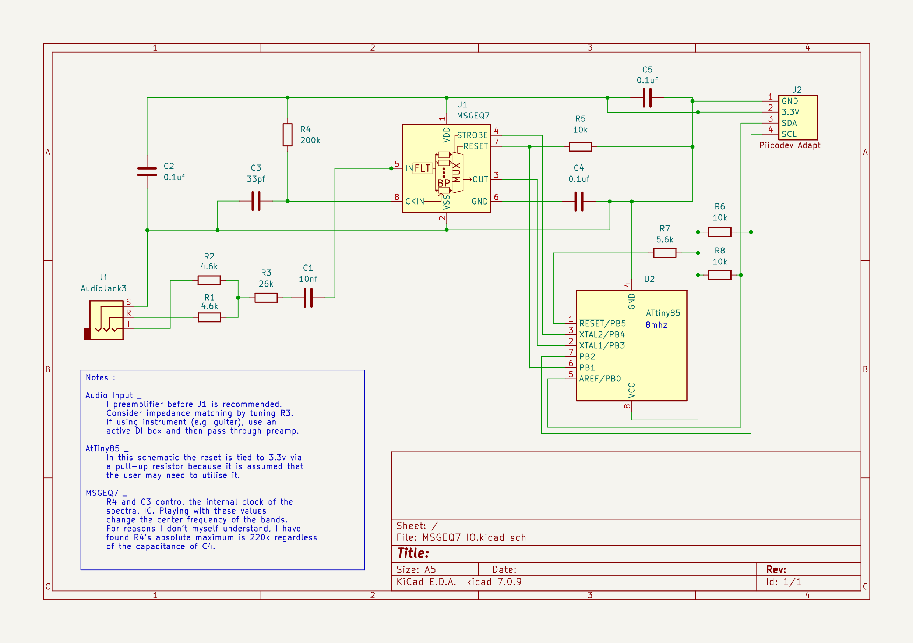

# Tinyi2cMsgEq7

Interface with [Mixed Signal Intergrations](https://mix-sig.com/) [MsgEq7](https://mix-sig.com/index.php/msgeq7-seven-band-graphic-equalizer-display-filter) via i2c.
The MsgEq7 is a 7 band spectral analyser with analogue filters, peak detection, and a multiplexor.
The [AtTiny85](https://www.microchip.com/en-us/product/attiny85) microprocessor is used as a slave device to interface between the i2c Bus and the MsgEq7.
A Trs 3.5mm jack is used as an audio input.


### Writeup

To build your own, you can find my complete writeup kindly hosted by Core-Electronics Australia.
[link to be added here on publish]()

### Dependencies

[TinyWireS](https://github.com/nadavmatalon/TinyWireS)

### Basics

The TinyI2cMsgEq7 joins an i2c bus at address 0x08.
When it first joins the bus it's ready to send data.
The MsgEq7 IC we are interfacing with has seven analogue bandpass filters which are multiplexed.
Requesting/reading data, using your favourite library, will return the peak amplitude of the next filter from multiplexor starting at the lowest frequency and working up.
When the 7th filter is read, it loops back to the first.

### Return Protocol

The Tinyi2cMsgEq7 transmit data back to an i2c Master in two bytes.

Each 16bit word contains in order :
 1. a void bit
 2. a 3 bit index representing one of the seven filters from the MsgEq7s Multiplexor (MSB)
 3. 2 void bits
 4. a 10bit value representing the output of the multiplexor at that index. (LSB)

The data is transmitted little endian.


### Example code

```cpp
#define WIRE Wire
#define SLAVE_ADDR 0x08

int graph[7];

void drawBand(int lsb, int msb) {
  int strobe = ((msb >> 4) & 0x07);
  Serial.print(strobe);
  Serial.print(":");
  int val = ((msb & 0x03) << 8) | (lsb);
  graph[strobe] = map(val, 0, 1024, 0, 12);
  for(int star = 0; star < graph[strobe]; star++) {
    Serial.print("*");
  }
  Serial.println("*");
}

void printNextBand() {
  Wire.requestFrom(SLAVE_ADDR, 2);
  int msb = 0;
  int lsb = 0;
  if (Wire.available()) {
    lsb = Wire.read();
    msb = Wire.read();
  }
  drawBand(lsb,msb);
}
```

### Sending Special Instructions

The Tinyi2cMsgEq7 listens for special `Command Bytes`.

```
| Command              | Byte | Description                  |
|----------------------|------|------------------------------|
| RESET_BYTE           | 0xB0 | Reset MsgEq7                 |
| SET_STROBE_BYTE      | 0xC0 | Jump to multiplexor position |
| WRITE_CYCLE_BYTE     | 0xF0 | Output all filters (1-7).    |
| WRITE_DELTA_BYTE     | 0xD0 | Output a batch of n filters  |
| WRITE_IMMEDIATE_BYTE | 0xA0 | Output bandpass at index     |
```

After a command byte has been transmitted, the requested data can be collected on the next read.
The Tinyi2cMsgEq7 will transmit the requested data instead of the default behaviour of transmitting a the next.
Here is an [example of Command Bytes](https://github.com/pixmusix/Tinyi2cMsgEq7/blob/main/examples/i2c_test/src/main.rs) (raspberry pi)

### Schematic


